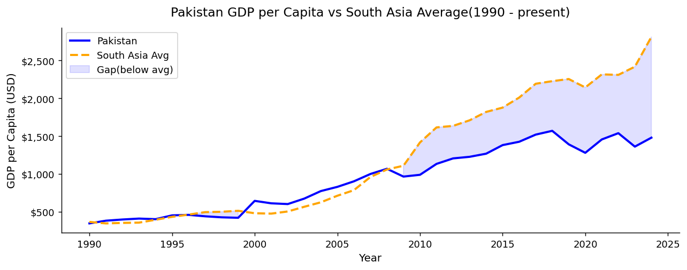
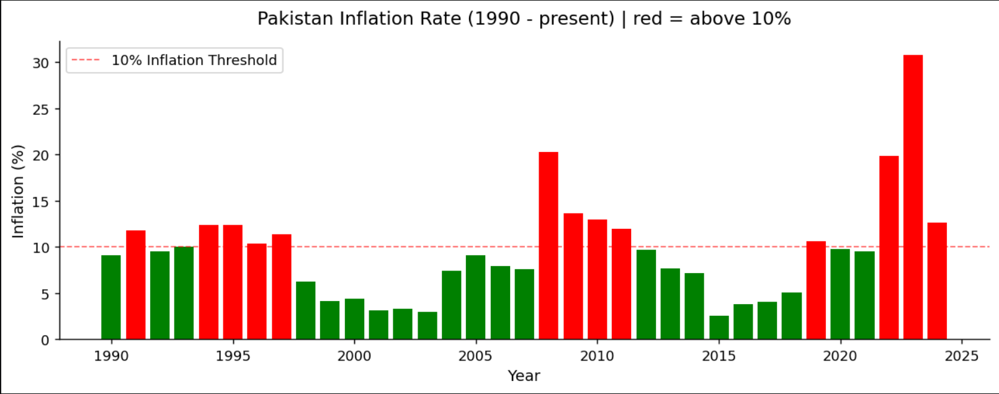
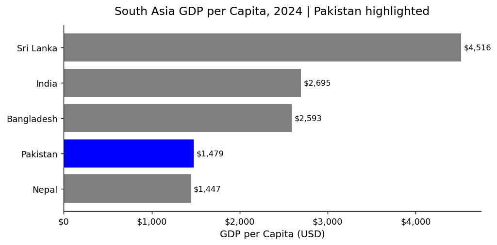
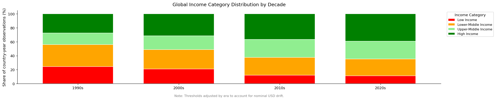

# World Bank Economic Indicators Analysis (1990 - Present)

**Tools:** Python · pandas · NumPy · matplotlib  
**Data:** 266 countries · 3 indicators · 9,000 rows  
**Skills shown:** Data cleaning · Wide-to-long reshaping · Feature engineering · EDA · Data visualization

---

## The One-Line Summary

Pakistan has consistently trailed its South Asian neighbours in GDP per capita for 35 years, while inflation spikes have been sharp, shock-driven, and recurring.

---

## The Problem

The World Bank publishes country-level economic data in wide format — one column per year — with regional aggregates mixed into the same file as real countries. Three separate indicator files needed to be cleaned, reshaped, and merged before any analysis was possible.

This project answers four questions:

- How has Pakistan's GDP per capita compared to the South Asia average since 1990?
- When did inflation crises hit and how severe were they?
- Where does Pakistan sit relative to its South Asian neighbours today?
- Has global income convergence actually happened across decades?

---

## The Dataset

**Source:** World Bank Open Data (public)  
**Files:** GDP.csv · inflation.csv · unemployment.csv  
**Coverage:** 266 countries · 1960 to present · 3 indicators

| Column | What It Means |
|---|---|
| `gdp_per_capita` | GDP per capita in current USD |
| `inflation_pct` | Annual consumer price inflation % |
| `unemployment_pct` | Unemployment as % of total labour force |
| `economic_stress_index` | Engineered: inflation + unemployment combined |
| `gdp_category` | Income tier: Low / Lower-Middle / Upper-Middle / High |
| `decade` | Decade label for grouped analysis |

---

## What I Built

### Step 1: Clean and Reshape
**File:** `world_bank_data_cleaning.ipynb`

Three problems with the raw files:
- Wide format: 71 columns per file, one per year
- Regional aggregates (WLD, ECA, etc.) mixed with real countries
- No shared structure across the three indicator files

Steps taken:
- Skipped 4 World Bank metadata rows on load
- Dropped unnamed trailing columns and redundant indicator columns
- Melted all three files from wide to long format
- Filtered to real countries only using country code length
- Merged all three indicators into one tidy dataset on Country Code and Year
- Engineered `economic_stress_index`, `gdp_category`, and `decade` columns
- Exported two outputs: full dataset (9,000 rows) and complete cases only (5,590 rows)

---

## Analysis and Visualizations

### Q1. How has Pakistan's GDP per capita trended vs the South Asia average?

Pakistan tracked closely with the South Asia average through the late 1990s. After 2000 the gap widened steadily as India and Sri Lanka drove the regional average upward through sustained productivity gains. Pakistan's trajectory shows boom-bust cycles rather than structural growth, suggesting dependence on remittances and consumption over export-led transformation.

---

### Q2. When did inflation crises hit Pakistan?

Inflation exceeded 10% during two concentrated periods: the early-to-mid 1990s and the 2008 to 2010 post-GFC spillover, with the worst spike in 2023 at over 30%. These are sharp shocks, not gradual drift, meaning Pakistan's inflation is largely shock-driven rather than chronic demand-pull. This matters for currency stability and monetary policy modeling.

---

### Q3. Where does Pakistan sit in South Asia today?

As of 2024, Pakistan's GDP per capita stands at $1,479, second lowest in South Asia above only Nepal ($1,447). It sits far below India ($2,695), Bangladesh ($2,593), and Sri Lanka ($4,516). Despite being the second largest economy in South Asia by population, Pakistan ranks near the bottom by per capita income.

---

### Q4. Has global income convergence happened?

The share of High Income and Upper-Middle Income countries has grown each decade since the 1990s, consistent with broad development gains across East Asia, Eastern Europe, and Latin America. However the Low Income share has not meaningfully declined, suggesting convergence is benefiting middle tiers disproportionately while the poorest economies remain structurally stuck.

---

## Key Findings

1. Pakistan has trailed the South Asia average in GDP per capita every year since the early 2000s, with the gap widening each decade.
2. Inflation in Pakistan is shock-driven, not chronic. Two concentrated crisis periods account for most of the high-inflation years.
3. Pakistan ranks 5th out of 6 South Asian countries in GDP per capita as of 2024.
4. Global income convergence is real but incomplete. The bottom tier has not meaningfully improved its share.
5. Unemployment data is the primary reliability constraint in this dataset. The economic stress index should be interpreted with caution due to coverage gaps in self-reported unemployment figures.

---

## Outputs

| File | Description |
|---|---|
| `world_bank_clean.csv` | Full cleaned dataset, 9,000 rows |
| `world_bank_complete_cases.csv` | Rows with all 3 indicators present, 5,590 rows |

---

## How to Run

1. Place GDP.csv, inflation.csv, and unemployment.csv in a `data/` folder
2. Install requirements: `pip install pandas numpy matplotlib`
3. Run all cells in `world_bank_data_cleaning.ipynb`

---

## About Me
Aiman Ishaq
Data analytics student building real projects on real data.

[GitHub](https://github.com/aiman-ami) · [LinkedIn](https://linkedin.com/in/aiman-ishaq)
